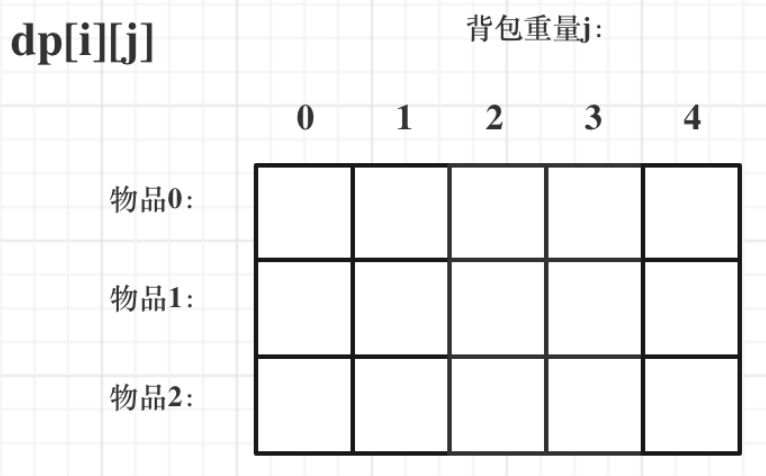

# Leetcode 刷题总结

## 1. 数组

### C++数组定义（初始化）

#### 普通形式：

```c++
int a[][] = {
    {1,2,3},
    {1,2,3}
};
```

#### vector形式：

```c++
#include <vector>
```

1. ##### 构造函数初始化

   ```c++
   vector<int> a(5,1); //5个1的一维数组
   vector<int> a = {1, 1, 1, 1, 1};
   vector<int> a; //空一维数组
   ```
2. ##### 数组地址初始化

   ```c++
   int a[] = { 3,3,3,1,2 };
   vector<int> b(a, a + sizeof(a) / sizeof(int)); //a的第一个元素到a的最后一个元素
   ```
3. ##### 二维数组

   ```c++
   vector<vector<int>> a(n, vector<int>(n,0)); //n*n的0数组
   ```

### 数组相关操作（包括字符串）

#### 数组中的for循环

```c++
for (char c : t) // t为字符串
for (string& str: strs) // strs为字符串vector vector<string>
```

#### 排序

```c++
#include<algorithm>
sort(vector.begin(), vector.end()) // 将vector中开始元素到结束元素进行排序
static bool cmp(const vector<int> &a, const vector<int> &b)
{
    if (a[0] == b[0])
    {
        return a[1] < b[1];
    }
    return a[0] > b[0];
}
sort(vector.begin(), vector.end(), cmp)
```

#### 数组末尾添加元素a（append）

```c++
vector.push_back(a)
vector.emplace_back(a); // 在不知道vector类型（维数）时慎用
```

#### 元素交换

```c++
swap(vector[i], vector[j]); // 交换vector的第i和j项
```

#### 重置数组的空间大小

```c++
vector.resize(size); // 将vector的元素重置为前size个
```

#### 判断数组是否为空

```c++
vector.empty(); // 返回布尔值
```

#### 清除数组元素

```c++
vector.erase(vector.begin(), vector.end());
```

#### 删除数组最后一个元素

```c++
vector.pop_back();
```

#### 颠倒数组顺序

```c++
#include<algorithm>
reverse(vector.begin(), vector.end());
```

#### 数组插入

```c++
vector.insert(res.begin() + pos, a);
```

### 1.1 二分查找

**通常适用于有序数组的查找 时间复杂度O(logn)**

34 704

* 定义左右指针
* while循环，条件为左小于等于右
* 循环中定义中指针为左右中点
* 将中指针与目标比较，根据比较结果更改左指针或右指针的值

```c++
int left = 0;
int right = nums.size() - 1;
while (left <= right) {
    int middle = (left + right) / 2;
    if (nums[middle] > target) {
    right = middle - 1;
    }
    else if (nums[middle] < target) {
    left = middle + 1;
    }
    else {
    return middle;
}
```

### 1.2 双指针

**可用于 `<u>`删除数组/链表内元素 `</u>`，`<u>`将元素移动到数组/链表后边 `</u>` `<u>`反转链表 `</u>`，`<u>`环链表 `</u>`，`<u>`n数之和 `</u>`等，时间复杂度O(n)**

15 18 19 26 27 142 151 206 283

* 定义快慢指针为0
* 快指针数组内循环
* 如果不需要删除或后移，用快指针给慢指针赋值，并且将慢指针后移
* 否则只有快指针后移

```c++
int slow = 0, fast = 0;
for (fast; fast < nums.size(); fast++ )
{
    if (nums[fast] != val) {
        nums[slow] = nums[fast];
        slow++;
    }
}
```

### 1.3 滑动窗口

76 209 904

**可用于寻找满足条件的长度最小数组 时间复杂度O(n)**

* 定义窗口的开始和结束边界
* 右边界数组内循环
* 找到右边界后，while循环，寻找满足条件的左边界的最大值

```c++
int result = INT32_MAX;
int sum = 0;
int start = 0, end = 0;
int length = 0;
for (end; end < nums.size(); end++) {
    sum += nums[end];
    while (sum >= target) {
        length = end - start + 1;
        result = length < result ? length : result;
        sum -= nums[start++];
    }
}
```

### 1.4 螺旋矩阵

54 59

* 定义每一圈的起始元素，剩余行列数
* while循环，每一圈剩余行列数各减2
* 循环中按照四边顺序进行赋值，注意区间开闭

```c++
int m = matrix.size();
int n = matrix[0].size();
int row = 0, column = 0;  
vector<int> result(m * n, 0);
int count = 0;
while (m > 0 && n > 0) {
    int i = row;
    int j = column;
    for (j; j < column + n - 1; j++) {
        result[count++] = matrix[i][j];
    }
    for (i; i < row + m - 1; i++) {
        result[count++] = matrix[i][j];
    }
    if (m == 1 && n != 1) {
        result[count++] = matrix[i][j];
    }
    else {
        for (j; j > column; j--) {
            result[count++] = matrix[i][j];
        }
    }    
    if (n == 1 && m != 1) {
        result[count++] = matrix[i][j];
    }
    else {
        for (i; i > row; i--) {
            result[count++] = matrix[i][j];
        }
    }

    if (m == 1 && n == 1) {
        result[count] = matrix[i][j];
    }
    m -= 2;
    n -= 2;
    row++;
    column++;
}
```

## 2.链表

### 链表结构体

```c++
struct ListNode {
    int val;
    ListNode *next;
    ListNode() : val(0), next(nullptr) {}
    ListNode(int x) : val(x), next(nullptr) {}
    ListNode(int x, ListNode *next) : val(x), next(next) {}
};
```

### 链表初始化

```c++
ListNode* sixth = new ListNode(5);
ListNode* fifth = new ListNode(3, sixth);
ListNode* ptr = head;
```

### 2.1 虚拟头结点

19 24 203

将原链表的头结点与后面普通节点的地位等同，不必单独考虑

* 定义一个新的虚拟结点，新节点的next指向原链表头结点
* cur从虚拟头结点开始
* 返回虚拟头结点的next也就是原head

```c++
ListNode* dummyHead = new ListNode(0); 
dummyHead->next = head; 
ListNode* cur = dummyHead;
```

## 3.哈希表

49 349 350 454

### 哈希表定义和常用语句

```c++
#include<unordered_map>
unordered_map<key类型, value类型>
```

```c++
map.begin()->first； // map元素的key
map.begin()->second； // map元素的value
```

```c++
#include<unordered_set>
unordered_set<int> set(nums1.begin(),nums1.end()); //从数组开始到数组结束给set赋值
set.find(value) == set.end(); // 判断是否在set内
set.insert(i); // 在set中添加元素
return vector<int>(set.begin(), set.end()); // 返回set中的所有元素
```

## 4.字符串

### 4.1 KMP：字符串匹配算法

前缀：包含首元素，不包含尾元素的全部子串

前缀表：从第一个前缀开始，记录每一个前缀的最长相等前缀后缀的长度，构成一个序列

a      0

aa    1

aab  0

aaba 1

...

先逐个匹配，在找到不匹配的点之后找到前面所有元素对应的前缀表的最大值，找到与其相等的前缀的后面重新开始匹配

## 5.栈与队列

**栈：先进后出**

**队列：先进先出**


### 栈语句

```c++
#include<stack>
stack<type> st；
st.push(x); // 入栈
st.empty(); // 判断是否为空
st.pop(); // 移除顶部元素
st.top(); // 顶部元素
```

### 队列语句

```c++
#include<queue>
queue<type> qu;
qu.push(x): // 入队
qu.empty(); // 判断是否为空
qu.pop(); // 移除顶部元素
qu.front(); //队首元素
qu.back(); //队尾元素
```

## 6.二叉树

种类：满二叉树和完全二叉树

满二叉树：如果一棵二叉树只有度为0的结点和度为2的结点，并且度为0的结点在同一层上，则这棵二叉树为满二叉树

完全二叉树：在完全二叉树中，除了最底层节点可能没填满外，其余每层节点数都达到最大值，并且最下面一层的节点都集中在该层最左边的若干位置

### 6.1 二叉树结构体定义

```c++
struct TreeNode {
    int val;
    TreeNode *left;
    TreeNode *right;
    TreeNode() : val(0), left(nullptr), right(nullptr) {}
    TreeNode(int x) : val(x), left(nullptr), right(nullptr) {}
    TreeNode(int x, TreeNode *left, TreeNode *right) : val(x), left(left), right(right) {}
 };
```

### 6.2 遍历方式

前序遍历：根节点 左节点 右节点

后序遍历：左节点 右节点 根节点

中序遍历：左节点 根节点 右节点

### 6.3 递归写法

* **确定递归函数的参数和返回值**（函数定义）
  确定哪些参数是递归的过程中需要处理的，那么就在递归函数里加上这个参数， 并且还要明确每次递归的返回值是什么进而确定递归函数的返回类型。
* **确定终止条件**（终止时返回）
  写完了递归算法, 运行的时候，经常会遇到栈溢出的错误，就是没写终止条件或者终止条件写的不对，操作系统也是用一个栈的结构来保存每一层递归的信息，如果递归没有终止，操作系统的内存栈必然就会溢出。
* **确定单层递归的逻辑**（主体部分 调用自己）
  确定每一层递归需要处理的信息。在这里也就会重复调用自己来实现递归的过程。

### 6.4 层序遍历的递归写法

```c++
class Solution
{
public:
    void order(TreeNode *cur, vector<vector<int>> &result, int depth)
    {
        if (cur == nullptr)
        {
            return;
        }

        if (result.size() == depth)
        {
            result.push_back(vector<int>());
        } // 初始化result[depth]

        result[depth].push_back(cur->val);
        order(cur->left, result, depth + 1);
        order(cur->right, result, depth + 1);
    }
    vector<vector<int>> levelOrder(TreeNode *root)
    {
        vector<vector<int>> result;
        int depth = 0;
        order(root, result, depth);
        return result;
    }
};
```

6.5 层序遍历的队列写法

```c++
class Solution
{
public:
    vector<int> rightSideView(TreeNode *root)
    {
        queue<TreeNode *> que;
        if (root != nullptr)
        {
            que.push(root);
        }
        vector<int> result;
        while (!que.empty())
        {
            int size = que.size();
            for (int i = 0; i < size; i++)
            {
                TreeNode *node = que.front();
                que.pop();                       //将前面的元素都删掉
                if (i == (size - 1))             //这一层的最后一个元素
                    result.push_back(node->val); // 将每一层的最后元素放入result数组中
                if (node->left)
                    que.push(node->left); //先放左边的
                if (node->right)
                    que.push(node->right); //后放右边的
            }
        }

        return result;
    }
};

```

## 7.回溯（搜索）法

**回溯算法能解决如下问题：**

- 组合问题：N个数里面按一定规则找出k个数的集合
- 排列问题：N个数按一定规则全排列，有几种排列方式
- 切割问题：一个字符串按一定规则有几种切割方式
- 子集问题：一个N个数的集合里有多少符合条件的子集
- 棋盘问题：N皇后，解数独等等

**回溯法解决的问题都可以抽象为树形结构**

回溯法解决的都是在集合中递归查找子集，**集合的大小就构成了树的宽度，递归的深度，都构成的树的深度**。

```c++
void backtracking(参数) {
    if (终止条件) { // 树的深度
        存放结果;
        return;
    }

    for (选择：本层集合中元素（树中节点孩子的数量就是集合的大小）) { // 每层的宽度
        处理节点;
        backtracking(路径，选择列表); // 递归
        回溯，撤销处理结果
    }
}
```

## 8.贪心算法

- 将问题分解为若干个子问题
- 找出适合的贪心策略
- 求解每一个子问题的最优解
- 将局部最优解堆叠成全局最优解

## 9.动态规划

* 确定dp数组以及下标的含义
  * 数组的值为状态量
* 确定状态转移方程，即递推关系
* dp数组初始化
* 确定遍历顺序
* 举例推导dp数组

### 背包问题

* 二维数组

​	按顺序取到第i个物品 装到容量为j的背包的最大价值

​	`dp[i][j] = max(dp[i-1][j], value[i] + dp[i-1][j-weight[i]])`

​	即不装该物品以及装该物品取得的最大值

​	遍历顺序无关紧要，先遍历物品或者重量都可以，因为前面的最大值来源于左上位置



* 一维滚动数组

  本质：将`d[i-1]`拷贝到`d[i]`

  `dp[j] = max(dp[j], dp[j - weight[i]] + value[i])`


但是对于`j`需要从右向左进行遍历，否则左侧的值会被覆盖，我们可以保证右边的值始终比之前大

* **给定容量，装满背包的最大价值**

```cpp
vector<int> dp(bagWeight + 1, 0);
for(int i = 0; i < weight.size(); i++) { // 遍历物品
    for(int j = bagWeight; j >= weight[i]; j--) { // 遍历背包容量
        dp[j] = max(dp[j], dp[j - weight[i]] + value[i]); // dp[j]:从物品0-i中取总和为j重量物品的最大价值
    }
}
```

* **给定容量，是否能装满背包** - 416. 分割等和子集

```cpp
vector<int> dp(10001, 0);
// 开始 01背包
for(int i = 0; i < nums.size(); i++) {
    for(int j = target; j >= nums[i]; j--) { // 每一个元素一定是不可重复放入，所以从大到小遍历
        dp[j] = max(dp[j], dp[j - nums[i]] + nums[i]); // dp[j]:从物品0-i中取总和为j的数的最大和，重量和价值都为nums
    }
}
// 集合中的元素正好可以凑成总和target
if (dp[target] == target) {
    return true;
}
```

* **给定容量，将可能装** -1049.最后一块石头的重量II

```cpp
vector<int> dp(15001, 0);
for (int i = 0; i < stones.size(); i++) { // 遍历物品
    for (int j = target; j >= stones[i]; j--) { // 遍历背包
        dp[j] = max(dp[j], dp[j - stones[i]] + stones[i]); // dp[j]:从物品0-i中取总和为j的数的最大和，重量和价值都为nums
    }
}
return sum - dp[target] - dp[target];
```

* **给定容量，装满背包有几种方法** - 494.目标和

```cpp
vector<int> dp(bagSize + 1, 0);
dp[0] = 1;
for (int i = 0; i < nums.size(); i++) {
    for (int j = bagSize; j >= nums[i]; j--) {
        dp[j] += dp[j - nums[i]];  //dp[j]: 将0到i物品装满容量为j的包有dp[j]种方法
    }
}
return dp[bagSize];
```

* **给定容量，最大物品个数** - 474.一和零

```cpp
vector<vector<int>> dp(m + 1, vector<int> (n + 1, 0)); // 默认初始化0
for (string str : strs) { // 遍历物品
	int oneNum = 0, zeroNum = 0;
	for (char c : str) {
		if (c == '0') zeroNum++;
		else oneNum++;
	}
	for (int i = m; i >= zeroNum; i--) { // 遍历背包容量且从后向前遍历！
		for (int j = n; j >= oneNum; j--) {
			dp[i][j] = max(dp[i][j], dp[i - zeroNum][j - oneNum] + 1); //dp[i][j]:容量为i个0，j个1时，最大的物品个数为dp[i][j]个
			}
		}	
	}
	return dp[m][n];
}
```

* **股票买卖最佳时机**

```c++
int maxProfit(int k, vector<int> &prices) {
    int len = prices.size();
    vector<vector<int>> dp(len, vector<int>(2 * k + 1));
    for (int i = 1; i < 2 * k; i+=2) {
        dp[0][i] = -prices[0]; //在第一天按照流程，不做操作为0，买入为负的价格，再卖出为零，再买入为新的负的价格
    }
    if (len > 1) {
        for (int i = 1; i < len; ++i) {
            dp[i][0] = 0; // 不做任何操作
            for (int j = 1; j <= k; ++j) {
                dp[i][2 * j - 1] = max(dp[i - 1][2 * j - 1], dp[i - 1][2 * j - 2] - prices[i]); //第i+1天第j次买入状态的最大值，由前i天的状态推出，前i天的最大值和当天在前一天的前一个状态重新执行买入操作进行比较
                dp[i][2 * j] = max(dp[i - 1][2 * j], dp[i - 1][2 * j - 1] + prices[i]); //第i+1天第j次卖出状态的最大值
            }
        }
    }
    return dp[len - 1][2 * k];
}
```


## 通用语句

### 条件赋值快速写法(三元运算符)

```c++
a = 条件 ？条件成立结果 ：条件不成立结果
```

### 类中调用自身函数

```c++
this->函数名（变量）
```

### 字符串与整型相互转化

```c++
#include <string>
stoi(a); // a为整型
to_string(a)； // a为字符串
```

### 获取命令行的输入

bracket表示的二维整型数组

```c++
int findFirstBracket(string input) {
    for (int i = 0; i < input.size(); i++) {
        if (input[i] == '[') {
            return i + 1;
        }
    }
    return -1;
}

// read the string in the representation of bracket to a vector<vector<int>>
vector<vector<int>> stringToVector(string input) {
    vector<vector<int>> result;
    // remove the first and last bracket
    input = input.substr(1, input.size() - 2);
    stringstream stringin(input);
    string temp;
    while (getline(stringin, temp, ']')) {
        if (temp.size() > 0) {
            // remove the first bracket
            int index = findFirstBracket(temp);
            temp = temp.substr(index, temp.size() - 1);
            stringstream stringin2(temp);
            int num;
            vector<int> temp2;
            while (getline(stringin2, temp, ',')) {
                if (temp.size() > 0) {
                    stringstream stringin3(temp);
                    stringin3 >> num;
                    temp2.push_back(num);
                }
            }
            result.push_back(temp2);
        }
  
    }
    return result; 
}

int main() {
    string input;
    vector<vector<int>> grid;
    getline(cin, input);
    grid = stringToVector(input);
}

```

整型数组 不含括号

```c++
#include <iostream>
#include <vector>
#include <string>
#include <sstream>

string input; //定义字符串input存放输入
vector<vector<int>> arr; //定义二维数组arr存放转化为数字后的输入
while (getline(cin, input)) { //将每行cin传给input
    if (input.size() > 0){
        stringstream stringin(input); //字符串流stringin，将input的空格隔开并转化为int
        int num;
        vector<int> a;
        while (stringin >> num) {
            a.push_back(num);
        }
        arr.push_back(a);
    }
}
```

